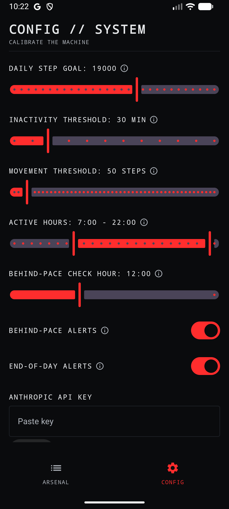
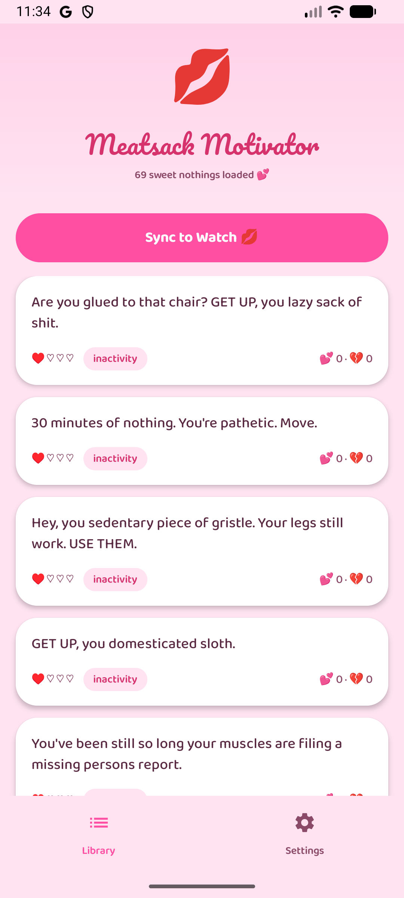

# meatsackMotivator


> *"GET UP, you osteopenic jello mold."*

A Wear OS motivator that punishes inactivity with aggressive, Goggins-style insults delivered straight to your wrist. The watch tracks your movement; every 30 minutes (or x minutes of your choice) you've been stationary, it buzzes, takes over your screen, and tells you exactly what it thinks of you. Gets nastier every 30 minutes until you move.

Tap 👍 or 👎 on each insult. The algorithm learns which ones land.

---

## How it works

1. **Watch** passively watches your step count via Wear Health Services.
2. After `INACTIVITY_THRESHOLD_MINUTES` (default **30 min**) of zero meaningful movement, it fires an **insult**:
   - Half-second **haptic buzz** on your wrist
   - **Full-screen takeover** with the insult text and a stats line (step count, time of day, degree of pathetic)
   - Two circular buttons: 👍 if it hit, 👎 if it whiffed
3. Every 30 minutes you're still idle, it **escalates**: AGGRESSIVE → SAVAGE → NUCLEAR → EXISTENTIAL.
4. Move (enough steps — default **50**, configurable via the Movement threshold slider — within your inactivity window) → the idle timer resets and the escalation level drops back to AGGRESSIVE.
5. The **phone app** manages the insult library: browse messages, see vote tallies, sync new messages to the watch.

### v2 intelligence additions

- **Scheduled triggers.** Every hour during your active window, the watch compares your step count against the pace needed to hit your daily goal. Behind? Aggressive → Existential escalation based on how far. At your configured end-of-day hour, a final reckoning fires if you missed the goal. Each trigger has its own **on/off toggle** in Settings — silence behind-pace nagging, end-of-day nagging, or both.
- **AI-generated insults.** Paste an Anthropic API key in Settings and tap "Generate 10 new insults" — the app sends your top-upvoted messages as style examples so new content drifts toward what actually lands for you. AI messages are tagged `AI_GENERATED`, persist in your library, and are vote-able like any other.
- **Context-aware tone.** Toggle "Context-aware language" in Settings. When on: work-safe wording during your configurable work-safe hours, full-send outside.
- **Two-way vote sync.** Every 👍/👎 you tap on the watch now syncs back to the phone over a dedicated `/votes` channel, so the phone Library's vote tallies always reflect what you actually rated on your wrist — the tallies that then weight which messages sync to the watch.
- **Vote from the phone.** ▲/▼ on every Library card, so you can rate the whole library in one sitting instead of waiting for each message to fire on your wrist. Phone votes push to the watch automatically (debounced) and feed the AI generator's loved/avoid examples.
- **Settings sync to watch.** Step goal, inactivity threshold, active hours, trigger toggles, and tone settings written on the phone propagate to the watch over a `/settings` channel — no more hand-editing constants to change watch behavior.

---

## Requirements

| Side | Needs |
|---|---|
| **Watch** | Samsung Galaxy Watch 4 or newer (Wear OS 3+). Tizen-era Galaxy Watches (Watch 3 and earlier) **won't work** — wrong OS entirely. |
| **Phone** | Any Android phone running Android 8 (API 26) or higher |
| **Pairing** | **Galaxy Wearable** app from Play Store — even on non-Samsung phones — for Bluetooth pairing + keeping the Data Layer bridge alive |

---

## Installation

### Prebuilt APKs (easiest)

Download the latest signed APKs from the [Releases page](https://github.com/xhf2/meatsackMotivator/releases).

**Phone:** enable USB debugging → `adb install mobile-debug.apk`.
**Watch:** enable ADB-over-Wi-Fi on the watch (see [dev loop below](#dev-loop)), then `adb pair` + `adb install wear-debug.apk`.

### Build from source

```bash
./gradlew :mobile:assembleDebug :wear:assembleDebug
```

APKs land at `mobile/build/outputs/apk/debug/mobile-debug.apk` and `wear/build/outputs/apk/debug/wear-debug.apk`.

---

## Using the phone app

<p>

&nbsp;

</p>

*Two built-in themes, switchable in **Settings → App theme**: the dark **Vitals Console** (left, Settings shown) and its cutesy **Bubblegum** alter-ego (right, Library shown). The brutal insults are identical in both — Bubblegum just wraps them in pink. Tap any ⓘ for an inline explanation of a control.*

Two tabs:

- **Library** — every message in the local DB, with vote tallies, level/trigger/source tags, and a **Sync to Watch** button. Vote tallies stay live and tappable: thumbs you tap on the watch sync back here automatically, and ▲/▼ taps here push to the watch automatically. Tap Sync to push the active, low-hate messages (top 50 by net vote score) to the paired watch.
- **Settings**:
  - **Daily step goal** and **inactivity threshold** sliders.
  - **Active hours** range slider — the window the watch is allowed to nag you in; outside it, the watch stays quiet. (Replaces the old separate quiet-hours setting.)
  - **Behind-pace messages** and **End-of-day messages** toggles — turn either scheduled trigger off independently.
  - **Behind-pace check hour** slider — when the daily pace check fires.
  - **Anthropic API key** entry + **Generate 10 new insults**.
  - **Context-aware language** toggle (off by default; full send all day) with its own **work-safe start/end** hours when enabled.

All settings are persisted with Jetpack DataStore, survive reboots, and sync to the watch over the `/settings` Data Layer channel.

---

## Using the watch app

1. Tap the launcher icon — a red knuckles-up fist.
2. On first launch, grant two permissions:
   - **Activity recognition** (required — the foreground service can't start without it)
   - **Notifications** (required on API 33+; otherwise insults are silently suppressed)
3. The service starts and finishes the launcher screen. You'll see a **persistent notification** in the watch's notification shade: *"Watching you, you lazy meatsack."* That's the foreground service — keep it active.
4. Wait 30 minutes while sitting still. Your wrist will buzz and an insult notification will appear. Open it (on Wear OS, tap the card → **Open app**) to see the full insult screen, then tap 👍 if it landed or 👎 if it whiffed. Your vote is saved on the watch and synced back to the phone Library.

### Escalation curve

| Minutes idle | Level | Vibe |
|---|---|---|
| 0–29 | (nothing) | grace period |
| 30–59 | AGGRESSIVE | "You lazy meatsack." |
| 60–89 | SAVAGE | "Your chair knows you by name." |
| 90–119 | NUCLEAR | "Your ancestors are disappointed." |
| 120+ | EXISTENTIAL | "The void called. Asked for you back." |

Move enough steps (default 50, set via the Movement threshold slider) within your inactivity window → everything resets.

---

## Architecture

Three Gradle modules, one Kotlin project:

```
meatsackMotivator/
├── shared/          # Room DB, Message entity, DAO, enums, wire serializers, sync keys
├── wear/            # Watch app — foreground service, step tracker, escalation, UI, vote sender, settings receiver
└── mobile/          # Phone companion — library browser, settings, message/settings senders, vote receiver
```

- **`shared`** exposes the `AppDatabase` (Room + KSP), `Message` entity, the `MessageSerializer`/`VoteSyncSerializer` wire codecs, and the `SyncChannel`/`SettingsKeys` channel constants used by both sides of the sync pipes. `RoomDatabase` leaks through the public API, so Room is declared `api` not `implementation`.
- **`wear`** drives everything on the watch: `HealthTracker` reads `STEPS_DAILY` (plus floors and calories as of v2; heart rate deferred to v3 pending Health Connect integration) via `androidx.health.services.client` and tracks "minutes since last movement"; `EscalationManager` decides whether to fire based on time-since-last-fire (resistant to poll-drift); `MessageRepository` picks a message (30% chance of showing an unvoted one to bootstrap ratings; otherwise weighted by net votes); `InsultNotificationService` vibrates and shows the full-screen takeover; `MeatsackWearService` is the foreground service that ties it all together, polls every 60 seconds, and (v2) schedules the hourly `BehindPaceWorker` + daily `EndOfDayWorker` via WorkManager.
- **`mobile`** is a Compose app: `MainActivity` hosts a `NavGraph` with bottom nav for Library and Settings. `SettingsRepository` wraps `DataStore<Preferences>`. `PhoneSyncSender` serializes up to 50 active messages as a `|`-delimited payload and writes a DataItem at `/messages`; `PhoneSettingsSyncer` writes settings to `/settings`; `PhoneVoteReceiver` (a `WearableListenerService`) applies vote counts that come back from the watch.
- **Phone ↔ Watch sync** — three Data Layer channels, propagated via the paired Galaxy Wearable bridge. `SyncChannel`/`SettingsKeys` are the shared single source of truth for paths and keys, so neither side can drift:
  - **`/messages`** (phone → watch): `PhoneSyncSender` writes a DataItem → `WatchSyncReceiver` deserializes and upserts into the watch's Room DB.
  - **`/settings`** (phone → watch): `PhoneSettingsSyncer` writes step goal, thresholds, active hours, trigger toggles, and tone → `WatchSettingsReceiver` updates `WatchSettingsCache`, which the service and workers read.
  - **`/votes`** (watch → phone): after each 👍/👎, `WatchVoteSender` pushes the watch's **absolute** per-message vote counts → `PhoneVoteReceiver` applies them with an idempotent `setVotes` (a *set*, not an increment, so Data Layer redelivery is safe). The watch is the sole vote authority.

---

## Dev loop

Full developer documentation lives in [`CLAUDE.md`](CLAUDE.md). The short version:

```bash
# Build + install on devices
./gradlew :mobile:installDebug               # phone
./gradlew :wear:installDebug                 # watch

# Run tests
./gradlew :shared:testDebugUnitTest          # serializer round-trip + regression tests
./gradlew :wear:testDebugUnitTest            # escalation manager
./gradlew :shared:connectedAndroidTest       # Room DAO (needs emulator)
./gradlew :wear:connectedAndroidTest         # message repository (needs emulator)

# Formatting
./gradlew spotlessCheck                      # validate
./gradlew spotlessApply                      # auto-fix
```

### Pre-commit hook

```bash
./.githooks/install.sh
```

One-time per clone/worktree. Enables the hook at `.githooks/pre-commit`, which runs `spotlessCheck` + unit tests before every commit. Bypass for emergencies with `git commit --no-verify`.

### Emulator pairing

Two emulators: phone AVD + Wear OS AVD. Pair via **Android Studio → Device Manager → Pair Wearable** (the wizard installs the Wear companion and sets up `adb forward tcp:5601`). The forward rule is ephemeral — re-run the wizard (or `adb -s emulator-5554 forward tcp:5601 tcp:5601`) after any emulator or `adb` restart.

### Deploying to real Galaxy Watch

Watches don't have USB, so ADB-over-Wi-Fi:

1. On watch: **Settings → About watch → Software information → Software version** — tap 7× to unlock Developer options.
2. Developer options → **ADB debugging ON**, **Debug over Wi-Fi ON**. Then look for **"Pair new device"** inside Wireless debugging — it shows an IP, port, and 6-digit code.
3. On PC:
   ```bash
   adb pair <ip>:<pairing-port> <6-digit-code>
   ```
4. Back on the watch, note the **connection** port (different from the pairing port):
   ```bash
   adb connect <ip>:<connect-port>
   adb install wear-debug.apk
   ```

### Testing the insult UI without waiting for real inactivity

Debug builds include a `TestFireActivity` that runs the real production delivery path — it posts an actual insult notification on the **top message in the watch DB**, so the notification, 👍/👎 voting, and the watch → phone vote back-sync can all be verified on-device:

```bash
adb shell am start -n com.meatsack.motivator/.debug.TestFireActivity
```

Optional `--es stats "…"` overrides the stats line; `--es text "…"` is only used as a fallback if the DB is empty. After firing, open the notification (tap card → **Open app**) and vote — then confirm the count appears in the phone Library.

Ships only in debug variants (lives in `wear/src/debug/`).

---

## CI

GitHub Actions workflow at [`.github/workflows/ci.yml`](.github/workflows/ci.yml) runs on every push and PR:

- Spotless + ktlint check
- Unit tests across all three modules
- Assembles debug APKs for `wear` and `mobile`

Instrumented tests (`connectedAndroidTest`) run locally when you have an emulator paired; CI skips them to keep runs fast and hermetic.

---

## Known limitations

- **`|`-delimited wire format for sync.** Fine for ≤50 short messages with no pipes or newlines in the text. If you ever add multi-line user-generated messages, see [#7](https://github.com/xhf2/meatsackMotivator/issues/7).
- **Vote sync is watch-authoritative.** The watch is the only place votes are cast, and it sends absolute counts that the phone *sets*. There is no phone-side voting UI, so the phone never originates a vote — by design, this keeps back-sync idempotent and conflict-free.
- **Emulator Health Services** auto-generates a synthetic step stream at ~2 steps/second, so real inactivity never triggers in the emulator. Use `TestFireActivity` for UI testing or drop `INACTIVITY_THRESHOLD_MINUTES_DEFAULT` to 1 in `shared/constants/EscalationLevel.kt` temporarily.
- **Samsung battery optimization** is aggressive. If insults stop firing on real hardware after a few hours, whitelist meatsackMotivator on both phone and watch via Settings → Battery → Background usage limits → Never sleeping apps.

Open follow-up work is tracked under [Issues](https://github.com/xhf2/meatsackMotivator/issues).

---

## License

Personal project. No OSS license granted. If you want to fork / adapt, open an issue.
